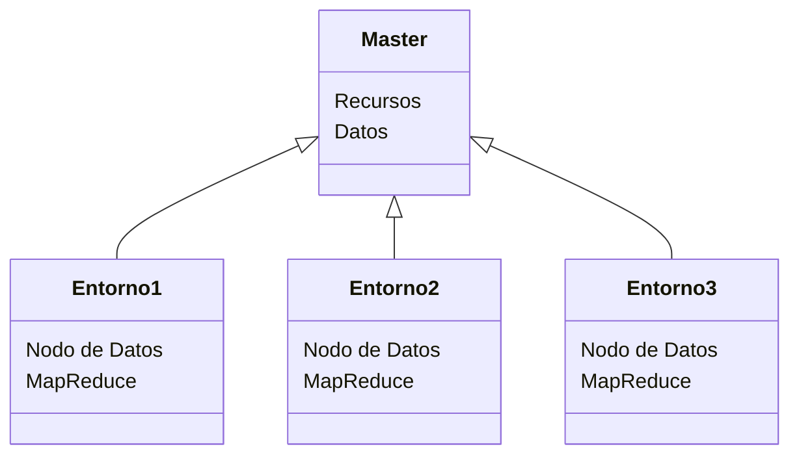

# Estructura básica de Hadoop trabajando con Docker en nuestra PC

Una vez instalado al 100% Docker sin errores, podemos crear un contenedor configurable para emular distintos escenarios, creando variables de entorno (un servidor) con la sig. estructura:

Nodo: http://<dockerhadoop_IP_address>:9870/dfshealth.html#tab-overview
Servidor de historial: http://<dockerhadoop_IP_address>:8188/applicationhistory
Nodo de datos: http://<dockerhadoop_IP_address>:9864/
Administrador de nodos: http://<dockerhadoop_IP_address>:8042/nodo
Administrador de recursos: http://<dockerhadoop_IP_address>:8088/

Ejemplo de creación de cluster, en la terminal ejecutaremos:
```
docker-compose up
```
### 

**Crear una estructura de carpetas para archivos de entrada**

Enumerar todos los archivos en nuestro sistema HDFS :

-   `hdfs dfs -ls /`
    

Tenemos que crear la caperta `/user/root/`, ya que hadoop trabaja con esta estructura definida, para lo anterior ejecutamos

-   `hdfs dfs -mkdir -p /user/root/`
    

Podemos verificar si se creó correctamente:

-   `hdfs dfs -ls /user/`
### Objetivos y supuestos de HDFS (Sistema de Archivos Distribuidos Hadoop)

**1. Falla del sistema:** Como un clúster de Hadoop consta de muchos nodos con hardware básico, es posible que falle el nodo, por lo que el objetivo fundamental de HDFS es descubrir este problema de falla y recuperarlo.

**2. Mantenimiento de un gran conjunto de datos:** Como HDFS maneja archivos de tamaño que van desde GB hasta PB, HDFS tiene que ser lo suficientemente fresco como para tratar estos conjuntos de datos muy grandes en un solo clúster.

**3. Mover datos es más costoso que mover el cálculo:** Si la operación computacional se realiza cerca de la ubicación donde están presentes los datos, entonces es bastante más rápido y el rendimiento general del sistema se puede aumentar junto con minimizar la congestión de la red, lo cual es una buena suposición.

**4. Portátil a través de varias plataformas:** HDFS posee portabilidad, lo que le permite cambiar a través de diversas plataformas de hardware y software.

**5. Modelo de coherencia simple:** Un sistema de archivos distribuido de Hadoop necesita un modelo para escribir una vez que se lee mucho acceso para los archivos. Un archivo escrito y luego cerrado no debe cambiarse, solo se pueden agregar datos. Esta suposición nos ayuda a minimizar el problema de la coherencia de los datos. MapReduce encaja perfectamente con este tipo de modelo de archivo.

**6. Escalabilidad:** HDFS está diseñado para ser escalable a medida que los requisitos de almacenamiento de datos aumentan con el tiempo. Se puede escalar o reducir verticalmente fácilmente agregando o eliminando nodos al clúster. Esto ayuda a garantizar que el sistema pueda manejar grandes cantidades de datos sin comprometer el rendimiento.

**7. Seguridad:** HDFS proporciona varios mecanismos de seguridad para proteger los datos almacenados en el clúster. Admite mecanismos de autenticación y autorización para controlar el acceso a los datos, el cifrado de datos en tránsito y en reposo, y comprobaciones de integridad de datos para detectar cualquier manipulación o corrupción.

**8. Localidad de los datos:**  HDFS tiene como objetivo mover el cálculo a donde residen los datos en lugar de mover los datos al cálculo. Este enfoque minimiza el tráfico de red y mejora el rendimiento mediante el procesamiento de datos en nodos locales.

**9. Rentable:**  HDFS puede ejecutarse en hardware básico de bajo costo, lo que lo convierte en una solución rentable para el procesamiento de datos a gran escala. Además, la capacidad de escalar hacia arriba o hacia abajo según sea necesario significa que las organizaciones pueden comenzar con algo pequeño y expandirse con el tiempo, lo que reduce los costos iniciales.

**10. Soporte para varios formatos de archivo:** HDFS está diseñado para admitir una amplia gama de formatos de archivo, incluidos datos estructurados, semiestructurados y no estructurados. Esto facilita el almacenamiento y el procesamiento de diferentes tipos de datos utilizando un único sistema, lo que simplifica la gestión de datos y reduce los costes.


# Ejemplo de MapReduce

### 

Descargar un script de ejemplo **MapReduce**

Usaremos un archivo .jar que contiene las clases necesarias para ejecutar el algoritmo MapReduce.

Esto se puede hacer manualmente, compilando los archivos .java. Sin embargo, para este tutorial, descargaremos el archivo .jar listo para usar.

1.  Ir a [https://repo1.maven.org/maven2/org/apache/hadoop/hadoop-mapreduce-examples/2.7.1/](https://repo1.maven.org/maven2/org/apache/hadoop/hadoop-mapreduce-examples/2.7.1/)
    
2.  Descargue el archivo con nombre `hadoop-mapreduce-examples-2.7.1-sources.jar`
    
3.  Mueva el archivo `hadoop-mapreduce-examples-2.7.1-sources.jar` a la misma carpeta donde esta el repositorio **docker-hadoop.**
    

### 

Archivo txt para procesar

La mayoría de las veces usaremos Hadoop para procesar archivos bastantes grandes, quizás de varios gigas, pero para esta ocasión usaremos un archivo de 1MB, el clásico libro “Don Quijote de La Mancha” como texto plano.

1.  Ir a [https://gist.github.com/jsdario/6d6c69398cb0c73111e49f1218960f79#file-el_quijote-txt](https://gist.github.com/jsdario/6d6c69398cb0c73111e49f1218960f79#file-el_quijote-txt)
    
2.  Descargue el archivo y descomprimalo.
    
3.  Mueva el archivo `el_quijote.txt`a la misma carpeta donde esta el repositorio **docker-hadoop.**
    

### 

**Copiar los archivos .jar y .txt al contenedor**

Para mover el archivo `hadoop-mapreduce-examples-2.7.1-sources.jar` ejecute

-   `docker cp hadoop-mapreduce-examples-2.7.1-sources.jar namenode:/tmp`
    

Haga lo mismo para el archivo `el_quijote.txt`

-   `docker cp el_quijote.txt namenode:/tmp`
    


### 

**Crea la carpeta de entrada dentro del contenedor** `namenode`

Ingrese al contenedor `namenode` ejecutando

-   `docker exec -it namenode bash`
    

Luego ejecute:

-   `hdfs dfs -mkdir /user/root/input_contador`
    

### 

**Copie su archivo .txt a HDFS**

Primero ejecute:

-   `cd /tmp`
    

Después:

-   `hdfs dfs -put el_quijote.txt /user/root/input_contador`
    

### 

**Ejecutar MapReduce**

Ejecutar

-   `hadoop jar hadoop-mapreduce-examples-2.7.1-sources.jar org.apache.hadoop.examples.WordCount input_contador output_contador`
    


### 

**Ver los resultados**

Ejecutar:

-   `hdfs dfs -cat /user/root/output_contador/*`


### 

**Apagar los contendores:**

-   Abrimos **Docker Desktop**
    
-   Damos click en el botón `stop` de contenedor **docker-hadoop**.

## Diágrama de funcionamiento

Usando [Mermaid](https://mermaidjs.github.io/) pude realizar este diagrama 


